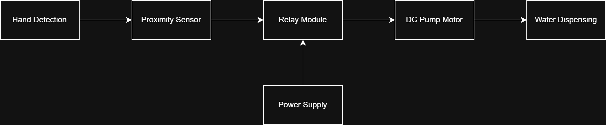

# Automatic Water Dispenser using Proximity Sensor and Relay Control

## Overview

This project presents the implementation of a contactless automatic water dispenser using a proximity sensor and relay-controlled pump motor.

The system enables touchless operation by detecting the presence of a hand and automatically activating the pump. Such systems are widely used in hygiene-sensitive environments and basic automation applications.

---

## Project Context

This system was implemented as part of a laboratory-level automation exercise involving sensor-based actuator control.

The objective of the project was to design a simple hardware automation workflow in which a proximity sensor directly controls a relay-driven pump motor for contactless water dispensing.

---

## Working Principle

The proximity sensor detects the presence of a hand within its sensing range.

When detection occurs:

• the sensor output activates the relay

• the relay switches the pump motor ON

• water is dispensed automatically

• the motor turns OFF when the hand is removed

This demonstrates a basic sensor-to-actuator automation control structure.

---

## System Architecture

The system architecture of the contactless water dispenser is shown below:

The relay provides electrical isolation between the sensing circuit and the motor switching circuit.

---

## System Components

The system consists of:

• proximity sensor

• relay module

• DC water pump motor

• external power supply

• connecting circuitry

---

## Applications

• contactless water dispensers

• hygiene automation systems

• smart home automation

• public sanitation setups

• sensor-based actuator control systems

---

## Learning Outcome

This project strengthened practical understanding of:

• proximity sensing principles

• relay-based switching systems

• actuator control using hardware logic

• sensor-to-actuator automation workflow

---

## Author

Vivek Singh

M.Sc. Automation and Control Engineering

RPTU Kaiserslautern-Landau
